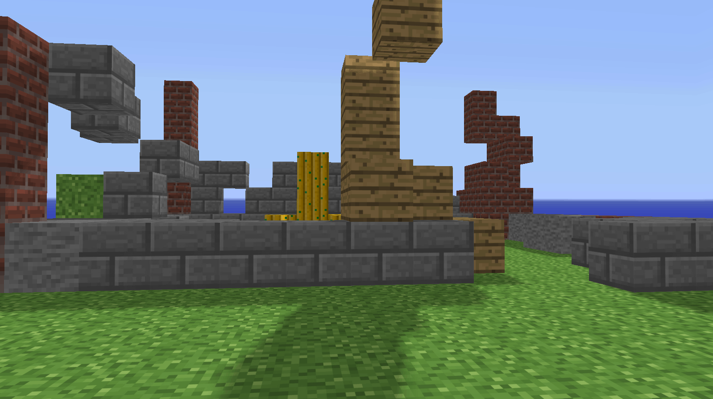

# Minecraft Clone on ModernGL

### Project Preview

## Features 
⚡️ Geometry Rendering and Shadows
⚡️ Cube Placement & destruction
⚡️ Physics
⚡️ Multiple Objects
⚡️ Audio
⚡️ Level Save

## Controls🎮 
- w: move forward
- a: move left
- s: move backwards
- d: move right
- space: place block
- backspace: remove block
- u: jump
- 1...10: select block
- i: save map
- o: load map

## Installation & Deployment 📦
- Clone the repository
- Download the Pygame, ModernGL, GLM and PyWaveFront using PIP
- Run main.py using Python 3.8 or higher

## Tools Used 🛠️
* <b>PyGame</b> - API for python with base game-developing utilities such as window rendering, input, texture loading and collisions
* <b>ModernGL</b> - Abstraction of OpenGL for python

## License

